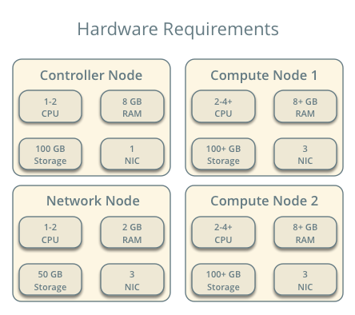
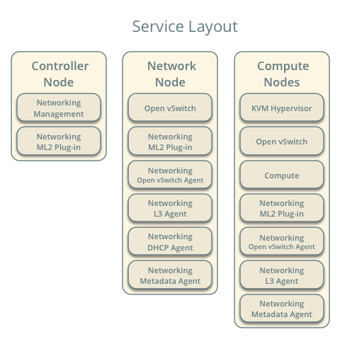
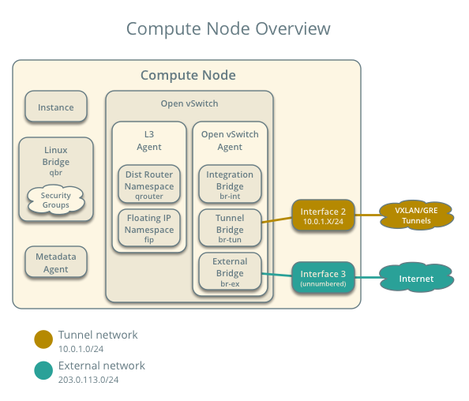
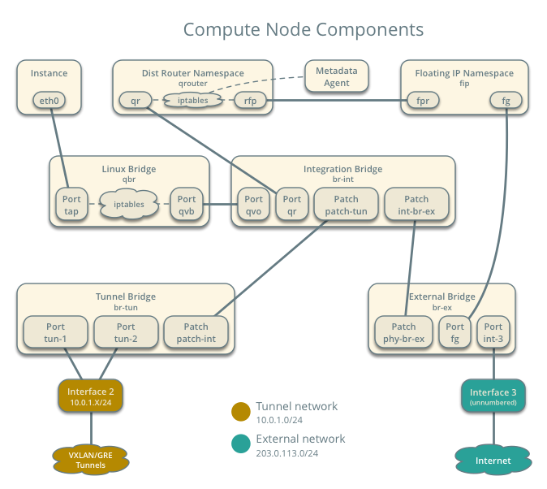
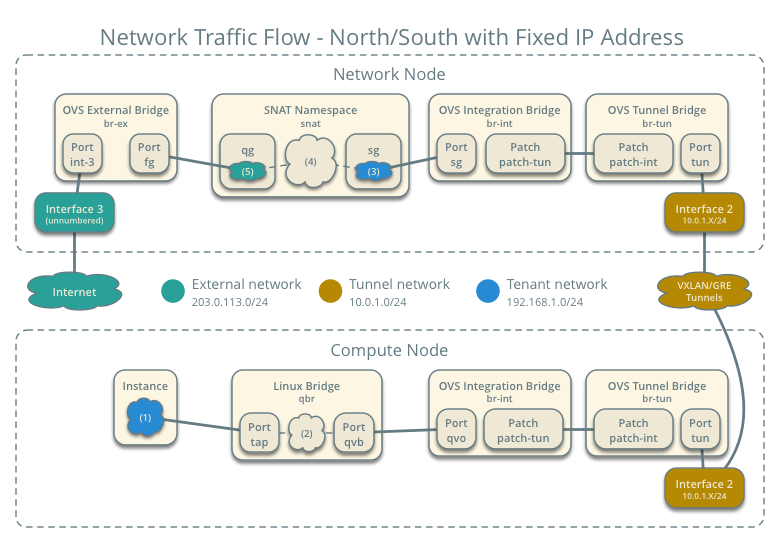
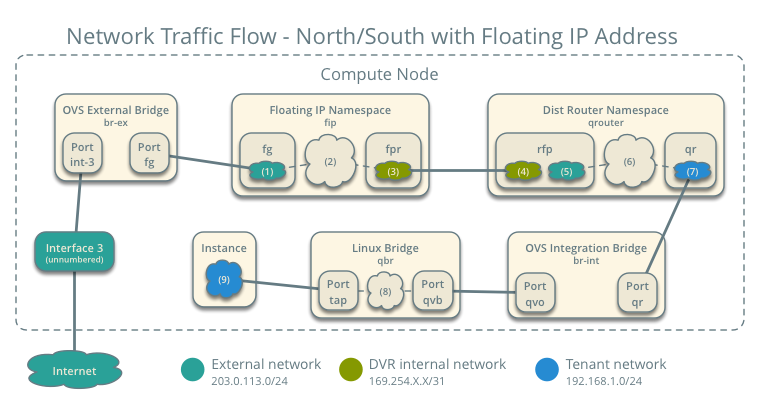
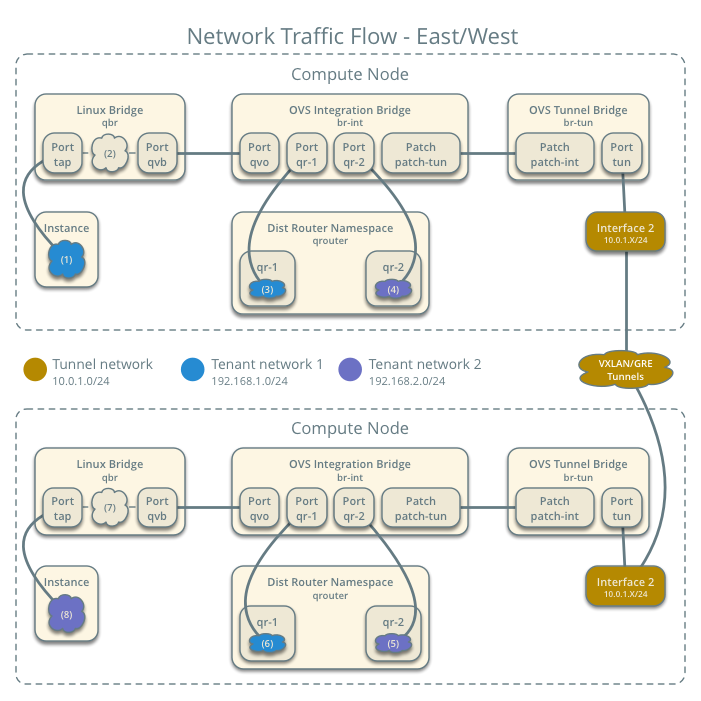

# Scenario: Basic implementation of DVR

This scenario describes a basic implementation of the OpenStack
Networking distributed virtual router (DVR) redundancy feature using
the ML2 plug-in with Open vSwitch (OVS). The example configuration
creates one flat external network and VXLAN tenant networks. However,
DVR also supports VLAN external networks and GRE tenant networks with
minor modifications to the example configuration.

## Requirements

1. One controller node with one network interface: management.

1. One network node with three network interfaces: management, instance
   tunnels, and external (typically the Internet). The Open vSwitch
   bridge `br-ex` must contain a port on the external interface.

1. At least two compute nodes with three network interfaces: management,
   instance tunnels, and external (typically the Internet). The Open
   vSwitch bridge `br-ex` must contain a port on the external interface.




**Warning: Proper operation of DVR requires Open vSwitch 2.1 or newer
and VXLAN requires kernel 3.13 or better. In general, only Fedora 20
currently meets or exceeds these minimum versions when using packages
rather than source. Also, the Juno release (2014.2) of neutron requires
at least the following patch for proper operation of DVR:**

https://review.openstack.org/#/c/133580/

**For best operation, consider using the *master* branch of neutron:**

http://git.openstack.org/cgit/openstack/neutron/

## Prerequisites

1. Controller node

  1. Operational SQL server with `neutron` database and appropriate
     configuration in the neutron-server.conf file.

  1. Operational message queue service with appropriate configuration
     in the neutron-server.conf file.

  1. Operational OpenStack Identity service with appropriate configuration
     in the neutron-server.conf file.

  1. Operational OpenStack Compute controller/management service with
     appropriate configuration to use neutron in the nova.conf file.

  1. Neutron server service, ML2 plug-in, and any dependencies.

1. Network node

  1. Operational OpenStack Identity service with appropriate configuration
     in the neutron-server.conf file.

  1. Open vSwitch service, ML2 plug-in, Open vSwitch agent, L3 agent,
     DHCP agent, metadata agent, and any dependencies including the
     `ipset` and `conntrack` utilities.

1. Compute nodes

  1. Operational OpenStack Identity service with appropriate configuration
     in the neutron-server.conf file.

  1. Operational OpenStack Compute controller/management service with
     appropriate configuration to use neutron in the nova.conf file.

  1. Open vSwitch service, ML2 plug-in, Open vSwitch agent, L3 agent,
     metadata agent, and any dependencies including the `ipset` and
     `conntrack` utilities.



## Architecture

### General

The general DVR architecture augments the legacy architecture by
providing direct access to the external network on compute nodes.
Routing among tenant and external networks resides completely on
the compute nodes to eliminate single point of failure and performance
issues with a network node. However, instances without a floating IP
address still use the network node for SNAT services.


Similar to the legacy architecture, the network node runs the L3
agent, DHCP agent, and metadata agent. DVR can coexist with multiple
DHCP agents. However, DHCP agents cannot run on compute nodes. In
addition to legacy `qrouter` namespaces, the L3 agent manages `snat`
namespaces that perform SNAT for any instances without a floating IP
address using tenant networks on distributed routers. For instances
using tenant networks on legacy routers, the `qrouter` namespaces
perform SNAT and handle metadata operations. The metadata agent
handles metadata operations for instances using tenant networks on
legacy routers.


Contrary to the legacy architecture, the compute node runs the L3
agent and metadata agent. The L3 agent manages `qrouter` namespaces
that route network traffic among tenant networks on the same
distributed router and external network traffic for instances with
a floating IP address. The L3 agent also manages `fip` namespaces
that perform DNAT and SNAT for instances with a floating IP address
using tenant networks on distributed routers. The metadata agent
handles metadata operations for instances using tenant networks
on distributed routers.



### Components

The network node contains the following components:

1. Open vSwitch agent managing virtual switches, connectivity among
   them, and interaction via virtual ports with other network components
   such as namespaces, Linux bridges, and underlying interfaces.

1. DHCP agent managing the `qdhcp` namespaces.

  1. The `dhcp` namespaces provide DHCP services for instances using 
     tenant networks on legacy and distributed routers.

1. L3 agent managing the `qrouter` and `snat` namespaces.

  1. For instances using tenant networks on distributed routers, the
     `qrouter` namespaces serve no purpose.

  1. For instances using tenant networks using legacy routers, the
     `qrouter` namespaces perform SNAT between tenant and external
     networks. They also route metadata traffic between instances using
     tenant networks on legacy routers and the metadata agent.

  1. For instances using tenant networks on distributed routers, the
     `snat` namespaces perform SNAT between tenant and external
     networks for instances without a floating IP address.

1. Metadata agent handling metadata operations.

  1. The metadata agent handles metadata operations for instances
     using tenant networks using legacy routers.


The compute nodes contain the following components:

1. Open vSwitch agent managing virtual switches, connectivity among
   them, and interaction via virtual ports with other network components
   such as namespaces, Linux bridges, and underlying interfaces.

1. L3 agent managing the `qrouter` and `fip` namespaces.

  1. For instances using tenant networks on distributed routers, the
     `qrouter` namespaces route *east-west* network traffic among tenant
     networks the same distributed router regardless of fixed or floating
     IP addresses.

  1. For instances using tenant networks on distributed routers, the
     `fip` namespaces perform DNAT and SNAT between tenant and external
     networks.

1. Metadata agent handling metadata operations.

  1. The metadata agent handles metadata operations for instances
     using tenant networks on distributed routers.

1. Linux bridges handling security groups.

  1. Due to limitations with Open vSwitch and *iptables*, the Networking
     service uses a Linux bridge to manage security groups for
     instances.



### Network traffic flows

For instances without a floating IP address using tenant networks on
distributed routers, the network node routes *north-south* network
traffic between tenant and external networks.

Note: The term *north-south* generally defines network traffic that
travels between tenant and external networks (typically the Internet).

General flow of instance network traffic from an instance to the
external network:

1. Instance network traffic with a destination outside of the tenant
   network egresses the instance (1) `tap` interface and travels to
   the Linux bridge `qbr` via `veth` pair.

1. Security group rules (2) on the Linux bridge `qbr` handle state tracking
   for the instance network traffic.

1. The instance network traffic egresses port `qvb` on the Linux bridge
   `qbr` and travels to the Open vSwitch integration bridge `br-int`
   via `veth` pair.

1. The instance network traffic egresses the Open vSwitch integration
   bridge `br-int` and travels to the Open vSwitch tunnel bridge
   `br-tun` that wraps it in a VXLAN or GRE tunnel.

1. The VXLAN or GRE tunnel egresses the physical tunnel interface on the
   compute node and travels to the physical tunnel interface on the network
   node.

1. The Open vSwitch tunnel bridge `br-tun` unwraps the instance traffic
   from the VXLAN or GRE tunnel.

1. The instance network traffic egresses the Open vSwitch tunnel bridge
   `br-tun` and travels to the Open vSwitch integration bridge `br-int`.

1. The instance network traffic egresses port `sg` on the Open vSwitch
   tunnel bridge `br-tun` and travels to the `sg` interface in the `snat`
   namespace (3). The `sg` interface contains the tenant network gateway
   IP address. In this example, 192.168.1.1/24.

1. The *iptables* service (4) performs SNAT on the instance network traffic
   using the `qg` interface in the `snat` namespace (5) as the source IP
   address.

1. The translated instance network traffic egresses the `qg` interface in
   the `snat` namespace and travels to the Open vSwitch external bridge
   `br-ex`.

1. The translated instance network traffic egresses the Open vSwitch
   external bridge `br-ex` and travels to the external network via
   the physical external interface on the network node.



For instances with a floating IP address using tenant networks on
distributed routers, the compute node containing the instance routes
*north-south* network traffic between tenant and external networks.
This traffic flow avoids the network node. For simplicity, the
following steps only cover the flow of instance network from the
external network to an instance.

General flow of instance network traffic from the external network to
an instance:

1. External network traffic travels to the Open vSwitch external bridge
   `br-ex` via the physical external interface on the compute node.

1. To be continued...



For instances with or without a floating IP address using networks on
distributed routers, the compute nodes route *east-west* network
traffic among tenant networks on the same distributed virtual router.
This traffic flow avoids the network node.

Note: The term *east-west* generally defines network traffic that
travels within a tenant network or between tenant networks.



## Configuration

### Controller node (controller)

The controller node provides the neutron API and manages services on the
other nodes.

1. Configure base options.

   1. Edit the /etc/neutron/neutron.conf file.

    ```
    [DEFAULT]
    verbose = True
    router_distributed = True
    core_plugin = ml2
    service_plugins = router
    allow_overlapping_ips = True
    allow_automatic_l3agent_failover = True

    notify_nova_on_port_status_changes = True
    notify_nova_on_port_data_changes = True
    nova_url = http://controller:8774/v2
    nova_region_name = regionOne
    nova_admin_username = NOVA_ADMIN_USERNAME
    nova_admin_tenant_id = NOVA_ADMIN_TENANT_ID
    nova_admin_password =  NOVA_ADMIN_PASSWORD
    nova_admin_auth_url = http://controller:35357/v2.0
    ```

  Note: Replace NOVA_ADMIN_USERNAME, NOVA_ADMIN_TENANT_ID, and
  NOVA_ADMIN_PASSWORD with suitable values for your environment.


1. Configure the ML2 plug-in.

  1. Edit the /etc/neutron/plugins/ml2/ml2_conf.ini file.

    ```
    [ml2]
    type_drivers = flat,vxlan
    tenant_network_types = vxlan
    mechanism_drivers = openvswitch,l2population

    [ml2_type_vxlan]
    vni_ranges = 1:1000
    vxlan_group = 239.1.1.1

    [securitygroup]
    enable_security_group = True
    firewall_driver = neutron.agent.linux.iptables_firewall.OVSHybridIptablesFirewallDriver
    enable_ipset = True
    ```

1. Start the following services:

  * Server

### Network node (network1)

The network node provides DHCP service to all instances and SNAT service to
instances without a floating IP address.

1. Configure base options.

  1. Edit the /etc/neutron/neutron.conf file.

    ```
    [DEFAULT]
    verbose = True
    router_distributed = True
    core_plugin = ml2
    service_plugins = router
    allow_overlapping_ips = True
    allow_automatic_l3agent_failover = True
    ```

1. Configure the ML2 plug-in.

  1. Edit the /etc/neutron/plugins/ml2/ml2_conf.ini file.

    ```
    [ml2]
    type_drivers = flat,vxlan
    tenant_network_types = vxlan
    mechanism_drivers = openvswitch,l2population

    [ml2_type_flat]
    flat_networks = external

    [ml2_type_vxlan]
    vni_ranges = 1:1000
    vxlan_group = 239.1.1.1

    [securitygroup]
    enable_security_group = True
    enable_ipset = True
    firewall_driver = neutron.agent.linux.iptables_firewall.OVSHybridIptablesFirewallDriver

    [ovs]
    local_ip = TENANT_NETWORK_TUNNELS_INTERFACE_IP_ADDRESS
    enable_tunneling = True
    bridge_mappings = external:br-ex

    [agent]
    l2population = True
    tunnel_types = vxlan
    enable_distributed_routing = True
    arp_responder = True
    ```

  Note: Replace TENANT_NETWORK_TUNNELS_INTERFACE_IP_ADDRESS with the IP
  address of the tenant network tunnels interface.

1. Configure the L3 agent.

  1. Edit the /etc/neutron/l3_agent.ini file.

    ```
    [DEFAULT]
    verbose = True
    interface_driver = neutron.agent.linux.interface.OVSInterfaceDriver
    use_namespaces = True
    external_network_bridge = br-ex
    router_delete_namespaces = True
    agent_mode = dvr_snat
    ```

1. Configure the DHCP agent.

  1. Edit the /etc/neutron/dhcp_agent.ini file.

    ```
    verbose = True
    interface_driver = neutron.agent.linux.interface.OVSInterfaceDriver
    dhcp_driver = neutron.agent.linux.dhcp.Dnsmasq
    use_namespaces = True
    dhcp_delete_namespaces = True
    ```

  1. (Optional) Reduce MTU for VXLAN tenant networks.

    1. Edit the /etc/neutron/dhcp_agent.ini file.

    ```
    dnsmasq_config_file = /etc/neutron/dnsmasq-neutron.conf
    ```

    1. Edit the /etc/neutron/dnsmasq-neutron.conf file.

    ```
    dhcp-option-force=26,1450
    ```

1. Configure the metadata agent.

  1. Edit the /etc/neutron/metadata_agent.ini file.

    ```
    [DEFAULT]
    verbose = True
    auth_url = http://controller:5000/v2.0
    auth_region = regionOne
    admin_tenant_name = ADMIN_TENANT_NAME
    admin_user = ADMIN_USER
    admin_password = ADMIN_PASSWORD
    nova_metadata_ip = controller
    metadata_proxy_shared_secret = METADATA_SECRET
    ```

  Note: Replace ADMIN_TENANT_NAME, ADMIN_USER, ADMIN_PASSWORD, and
  METADATA_SECRET with suitable values for your environment.

1. Start the following services:

  * Open vSwitch
  * Open vSwitch agent
  * L3 agent
  * DHCP agent
  * Metadata agent

### Compute nodes (compute1 and compute2)

The compute nodes contain the DVR components and handle floating IP
addresses.

1. Configure base options.

  1. Edit the /etc/neutron/neutron.conf file.

    ```
    [DEFAULT]
    verbose = True
    router_distributed = True
    core_plugin = ml2
    service_plugins = router
    allow_overlapping_ips = True
    ```

1. Configure the ML2 plug-in.

  1. Edit the /etc/neutron/plugins/ml2/ml2_conf.ini file.

    ```
    [ml2]
    type_drivers = flat,vxlan
    tenant_network_types = vxlan
    mechanism_drivers = openvswitch,l2population

    [ml2_type_flat]
    flat_networks = external

    [ml2_type_vxlan]
    vni_ranges = 1:1000
    vxlan_group = 239.1.1.1

    [securitygroup]
    enable_security_group = True
    enable_ipset = True
    firewall_driver = neutron.agent.linux.iptables_firewall.OVSHybridIptablesFirewallDriver

    [ovs]
    local_ip = TENANT_NETWORK_TUNNELS_INTERFACE_IP_ADDRESS
    enable_tunneling = True
    bridge_mappings = external:br-ex

    [agent]
    l2population = True
    tunnel_types = vxlan
    enable_distributed_routing = True
    arp_responder = True
    ```

  Note: Replace TENANT_NETWORK_TUNNELS_INTERFACE_IP_ADDRESS with the IP
  address of the tenant network tunnels interface.

1. Configure the L3 agent.

  1. Edit the /etc/neutron/l3_agent.ini file.

    ```
    [DEFAULT]
    verbose = True
    interface_driver = neutron.agent.linux.interface.OVSInterfaceDriver
    use_namespaces = True
    router_delete_namespaces = True
    agent_mode = dvr
    ```

1. Configure the metadata agent.

  1. Edit the /etc/neutron/metadata_agent.ini file.

    ```
    [DEFAULT]
    verbose = True
    auth_url = http://controller:5000/v2.0
    auth_region = regionOne
    admin_tenant_name = ADMIN_TENANT_NAME
    admin_user = ADMIN_USER
    admin_password = ADMIN_PASSWORD
    nova_metadata_ip = controller
    metadata_proxy_shared_secret = METADATA_SECRET
    ```

  Note: Replace ADMIN_TENANT_NAME, ADMIN_USER, ADMIN_PASSWORD, and
  METADATA_SECRET with suitable values for your environment.

1. Start the following services:

  * Open vSwitch
  * Open vSwitch agent
  * L3 agent
  * Metadata agent

### Verify service operation

1. Source the administrative tenant credentials.

1. Verify presence and operation of the agents.

  ```
  $ neutron agent-list
  +--------------------------------------+--------------------+----------+-------+----------------+---------------------------+
  | id                                   | agent_type         | host     | alive | admin_state_up | binary                    |
  +--------------------------------------+--------------------+----------+-------+----------------+---------------------------+
  | 10b084e5-4ab8-43d6-9b04-6d56f27f9cd4 | Metadata agent     | network1 | :-)   | True           | neutron-metadata-agent    |
  | 2f90ef81-3eed-4ecf-b6b9-2d2c21dda85c | Open vSwitch agent | compute2 | :-)   | True           | neutron-openvswitch-agent |
  | 319563ac-88f9-4352-b63e-e55beb673372 | DHCP agent         | network1 | :-)   | True           | neutron-dhcp-agent        |
  | 3345723e-16e8-4b74-9d15-d7f1f977a3bd | Open vSwitch agent | compute1 | :-)   | True           | neutron-openvswitch-agent |
  | 4643c811-a54a-41da-91a8-c2328bcaeea3 | Open vSwitch agent | network1 | :-)   | True           | neutron-openvswitch-agent |
  | 5ad81671-efc3-4acc-9d5d-030a1c4f6a25 | L3 agent           | compute1 | :-)   | True           | neutron-l3-agent          |
  | 641337fa-99c2-468d-8d7e-89277d6ba144 | Metadata agent     | compute1 | :-)   | True           | neutron-metadata-agent    |
  | 9372e008-bd29-4436-8e01-8ddfd50d2b74 | L3 agent           | network1 | :-)   | True           | neutron-l3-agent          |
  | af9d1169-1012-4440-9de2-778c8fce21b9 | L3 agent           | compute2 | :-)   | True           | neutron-l3-agent          |
  | ee59e3ba-ee3c-4621-b3d5-c9d8123b6cc5 | Metadata agent     | compute2 | :-)   | True           | neutron-metadata-agent    |
  +--------------------------------------+--------------------+----------+-------+----------------+---------------------------+
  ```

## Create initial networks

### External (flat) network

1. Source the administrative tenant credentials.

1. Create the external network.

  ```
  $ neutron net-create ext-net --shared --router:external True \
    --provider:physical_network external --provider:network_type flat
  Created a new network:
  +---------------------------+--------------------------------------+
  | Field                     | Value                                |
  +---------------------------+--------------------------------------+
  | admin_state_up            | True                                 |
  | id                        | 893aebb9-1c1e-48be-8908-6b947f3237b3 |
  | name                      | ext-net                              |
  | provider:network_type     | flat                                 |
  | provider:physical_network | external                             |
  | provider:segmentation_id  |                                      |
  | router:external           | True                                 |
  | shared                    | True                                 |
  | status                    | ACTIVE                               |
  | subnets                   |                                      |
  | tenant_id                 | 54cd044c64d5408b83f843d63624e0d8     |
  +---------------------------+--------------------------------------+
  ```

1. Create a subnet on the external network.

  ```
  $ neutron subnet-create ext-net --name ext-subnet --allocation-pool \
    start=203.0.113.101,end=203.0.113.200 --disable-dhcp \
    --gateway 203.0.113.1 203.0.113.0/24
  Created a new subnet:
  +-------------------+------------------------------------------------------+
  | Field             | Value                                                |
  +-------------------+------------------------------------------------------+
  | allocation_pools  | {"start": "203.0.113.101", "end": "203.0.113.200"}   |
  | cidr              | 203.0.113.0/24                                       |
  | dns_nameservers   |                                                      |
  | enable_dhcp       | False                                                |
  | gateway_ip        | 203.0.113.1                                          |
  | host_routes       |                                                      |
  | id                | 9159f0dc-2b63-41cf-bd7a-289309da1391                 |
  | ip_version        | 4                                                    |
  | ipv6_address_mode |                                                      |
  | ipv6_ra_mode      |                                                      |
  | name              | ext-subnet                                           |
  | network_id        | 893aebb9-1c1e-48be-8908-6b947f3237b3                 |
  | tenant_id         | 54cd044c64d5408b83f843d63624e0d8                     |
  +-------------------+------------------------------------------------------+
  ```

### Tenant (VXLAN) network

1. Source the regular tenant credentials.

1. Create the tenant network.

  ```
  $ neutron net-create demo-net
  Created a new network:
  +-----------------+--------------------------------------+
  | Field           | Value                                |
  +-----------------+--------------------------------------+
  | admin_state_up  | True                                 |
  | id              | ac108952-6096-4243-adf4-bb6615b3de28 |
  | name            | demo-net                             |
  | router:external | False                                |
  | shared          | False                                |
  | status          | ACTIVE                               |
  | subnets         |                                      |
  | tenant_id       | cdef0071a0194d19ac6bb63802dc9bae     |
  +-----------------+--------------------------------------+
  ```

1. Create a subnet on the tenant network.

  ```
  $ neutron subnet-create demo-net --name demo-subnet --gateway 192.168.1.1 192.168.1.0/24
  Created a new subnet:
  +-------------------+------------------------------------------------------+
  | Field             | Value                                                |
  +-------------------+------------------------------------------------------+
  | allocation_pools  | {"start": "192.168.1.2", "end": "192.168.1.254"}     |
  | cidr              | 192.168.1.0/24                                       |
  | dns_nameservers   |                                                      |
  | enable_dhcp       | True                                                 |
  | gateway_ip        | 192.168.1.1                                          |
  | host_routes       |                                                      |
  | id                | 69d38773-794a-4e49-b887-6de6734e792d                 |
  | ip_version        | 4                                                    |
  | ipv6_address_mode |                                                      |
  | ipv6_ra_mode      |                                                      |
  | name              | demo-subnet                                          |
  | network_id        | ac108952-6096-4243-adf4-bb6615b3de28                 |
  | tenant_id         | cdef0071a0194d19ac6bb63802dc9bae                     |
  +-------------------+------------------------------------------------------+
  ```

1. Create a distributed virtual router. Configuring the
   `router_distributed = True` option in the /etc/neutron/neutron.conf
   file creates distributed routers by default.

  ```
  $ neutron router-create demo-router
  Created a new router:
  +-----------------------+--------------------------------------+
  | Field                 | Value                                |
  +-----------------------+--------------------------------------+
  | admin_state_up        | True                                 |
  | distributed           | True                                 |
  | external_gateway_info |                                      |
  | ha                    | False                                |
  | id                    | 635660ae-a254-4feb-8993-295aa9ec6418 |
  | name                  | demo-router                          |
  | routes                |                                      |
  | status                | ACTIVE                               |
  | tenant_id             | cdef0071a0194d19ac6bb63802dc9bae     |
  +-----------------------+--------------------------------------+
  ```

  Note: Default policy might prevent the 'distributed' flag from
  appearing in the command output.

1. Add a tenant subnet interface on the router.

  ```
  $ neutron router-interface-add demo-router demo-subnet
  Added interface b1a894fd-aee8-475c-9262-4342afdc1b58 to router demo-router.
  ```

1. Add a gateway to the external network on the router.

  ```
  $ neutron router-gateway-set demo-router ext-net
  Set gateway for router demo-router
  ```

## Verify operation

1. On the network node, verify creation of the 'snat', 'qrouter', and 'qdhcp'
   namespaces.

  ```
  # ip netns
  snat-4d7928a0-4a3c-4b99-b01b-97da2f97e279
  qrouter-4d7928a0-4a3c-4b99-b01b-97da2f97e279
  qdhcp-353f5937-a2d3-41ba-8225-fa1af2538141
  ```

1. On the controller node, ping the tenant router gateway IP address,
   typically the lowest IP address in the external network subnet
   allocation range.

  ```
  # ping -c 4 203.0.113.101
  PING 203.0.113.101 (203.0.113.101) 56(84) bytes of data.
  64 bytes from 203.0.113.101: icmp_req=1 ttl=64 time=0.619 ms
  64 bytes from 203.0.113.101: icmp_req=2 ttl=64 time=0.189 ms
  64 bytes from 203.0.113.101: icmp_req=3 ttl=64 time=0.165 ms
  64 bytes from 203.0.113.101: icmp_req=4 ttl=64 time=0.216 ms

  --- 203.0.113.101 ping statistics ---
  4 packets transmitted, 4 received, 0% packet loss, time 2999ms
  rtt min/avg/max/mdev = 0.165/0.297/0.619/0.187 ms
  ```

1. Source the regular tenant credentials.

1. Launch an instance with an interface on the tenant network.

1. On the compute node with the instance, verify creation of the 'qrouter'
   namespace.

  ```
  # ip netns
  qrouter-4d7928a0-4a3c-4b99-b01b-97da2f97e279
  ```

1. Obtain console access to the instance.

  1. Test connectivity to the tenant network router.

    ```
    $ ping -c 4 192.168.1.1
    PING 192.168.1.1 (192.168.1.1) 56(84) bytes of data.
    64 bytes from 192.168.1.1: icmp_req=1 ttl=64 time=0.357 ms
    64 bytes from 192.168.1.1: icmp_req=2 ttl=64 time=0.473 ms
    64 bytes from 192.168.1.1: icmp_req=3 ttl=64 time=0.504 ms
    64 bytes from 192.168.1.1: icmp_req=4 ttl=64 time=0.470 ms

    --- 192.168.1.1 ping statistics ---
    4 packets transmitted, 4 received, 0% packet loss, time 2998ms
    rtt min/avg/max/mdev = 0.357/0.451/0.504/0.055 ms
    ```

  1. Test connectivity to the Internet.

    ```
    $ ping -c 4 openstack.org
    PING openstack.org (174.143.194.225) 56(84) bytes of data.
    64 bytes from 174.143.194.225: icmp_req=1 ttl=53 time=17.4 ms
    64 bytes from 174.143.194.225: icmp_req=2 ttl=53 time=17.5 ms
    64 bytes from 174.143.194.225: icmp_req=3 ttl=53 time=17.7 ms
    64 bytes from 174.143.194.225: icmp_req=4 ttl=53 time=17.5 ms

    --- openstack.org ping statistics ---
    4 packets transmitted, 4 received, 0% packet loss, time 3003ms
    rtt min/avg/max/mdev = 17.431/17.575/17.734/0.143 ms
    ```

1. Create the appropriate security group rules to allow ping and SSH access
   to the instance.

1. Create a floating IP address.

  ```
  $ neutron floatingip-create ext-net
  Created a new floatingip:
  +---------------------+--------------------------------------+
  | Field               | Value                                |
  +---------------------+--------------------------------------+
  | fixed_ip_address    |                                      |
  | floating_ip_address | 203.0.113.102                        |
  | floating_network_id | 9bce64a3-a963-4c05-bfcd-161f708042d1 |
  | id                  | 05e36754-e7f3-46bb-9eaa-3521623b3722 |
  | port_id             |                                      |
  | router_id           |                                      |
  | status              | DOWN                                 |
  | tenant_id           | 7cf50047f8df4824bc76c2fdf66d11ec     |
  +---------------------+--------------------------------------+
  ```

1. Associate the floating IP address with the instance.

  ```
  $ nova floating-ip-associate demo-instance1 203.0.113.102
  ```

1. On the compute node with the instance, verify creation of the 'fip'
   namespace.

  ```
  # ip netns
  fip-2c7bd9c2-8ab0-46ef-b7c1-023ce0452c24
  ```

1. On the controller node, ping the floating IP address associated with
   the instance.

  ```
  $ ping -c 4 203.0.113.102
  PING 203.0.113.102 (203.0.113.112) 56(84) bytes of data.
  64 bytes from 203.0.113.102: icmp_req=1 ttl=63 time=3.18 ms
  64 bytes from 203.0.113.102: icmp_req=2 ttl=63 time=0.981 ms
  64 bytes from 203.0.113.102: icmp_req=3 ttl=63 time=1.06 ms
  64 bytes from 203.0.113.102: icmp_req=4 ttl=63 time=0.929 ms

  --- 203.0.113.102 ping statistics ---
  4 packets transmitted, 4 received, 0% packet loss, time 3002ms
  rtt min/avg/max/mdev = 0.929/1.539/3.183/0.951 ms
  ```
